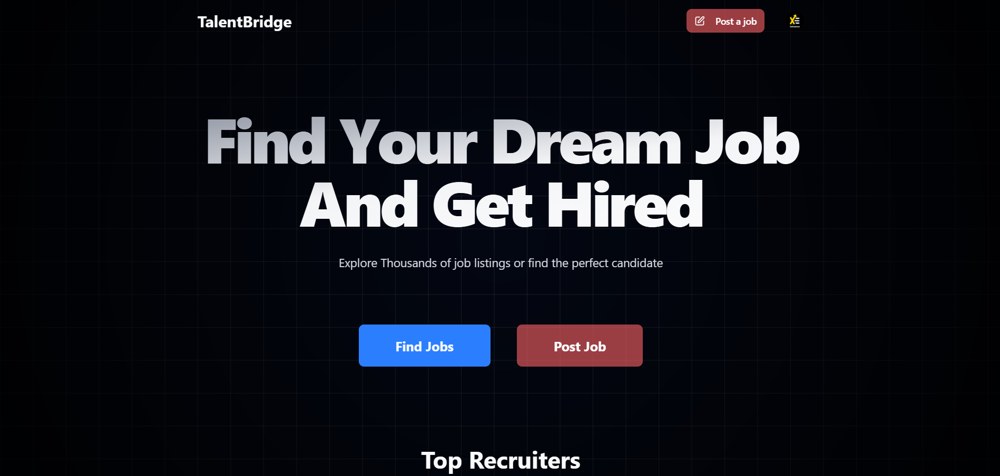

# 🌉 TalentBridge



**TalentBridge** is a modern job listing and hiring platform that connects top talent with the right opportunities—faster, smarter, and more efficiently. Built with performance and scalability in mind, TalentBridge simplifies recruitment for both job seekers and hiring companies.

---

## 🚀 Features

- 🔍 **Job Listings & Search** – Seamless search and filter to find the right jobs instantly.
- 📝 **Resume Submission** – Easy and efficient applicant onboarding process.
- 🏢 **Company Dashboard** – Intuitive interface for recruiters to post and manage openings.
- 📄 **Candidate Profiles** – Smart and clean profile representation for better hiring decisions.
- 🔔 **Real-Time Notifications** – Keep both candidates and recruiters in the loop.
- 🌐 **Fully Responsive UI** – Works perfectly across desktops, tablets, and mobile devices.

---

## 🛠️ Tech Stack

| Layer               | Technology                      |
| ------------------- | ------------------------------- |
| **Frontend**        | React (or preferred JS library) |
| **Build Tool**      | Vite                            |
| **Styling**         | Tailwind CSS / Custom CSS       |
| **Linting**         | ESLint                          |
| **Package Manager** | npm                             |
| **Hosting**         | (Optional: Vercel / Netlify)    |

---

## 📁 Project Structure

```
TalentBridge/
├── public/ # Static assets
├── src/ # Main source code
│ ├── components/ # Reusable UI components
│ ├── pages/ # Pages/Routes
│ ├── assets/ # Images and icons
│ └── App.jsx # Entry point for app
├── index.html # Root HTML file
├── vite.config.js # Vite configuration
├── package.json # Project metadata and dependencies
├── .env # Environment variables
└── README.md # Project documentation
```

---

## 📦 Installation & Setup

### Clone the repository

```bash
git clone https://github.com/adityadhiman-in/TalentBridge.git
cd TalentBridge
```

### Install dependencies

```
npm install
```

### Start the development server

```
npm run dev
```

### Build for production

```
npm run build
```

## Contributing

Contributions, issues, and feature requests are welcome!
Feel free to check the issues page.

To contribute:

Fork the repository.

Create your feature branch (git checkout -b feature-name)

Commit your changes (git commit -m 'Add new feature')

Push to the branch (git push origin feature-name)

Open a pull request.

## License

This project is licensed under the MIT License.

## Contact

Feel free to reach out if you have any questions or suggestions!

- [Website](https://adityadhiman.in)
- [GitHub](https://github.com/adityadhiman-in)
- [LinkedIn](https://www.linkedin.com/in/adityadhiman-in)

Made with ❤️ by [Aditya Dhiman](https://adityadhiman.in)
